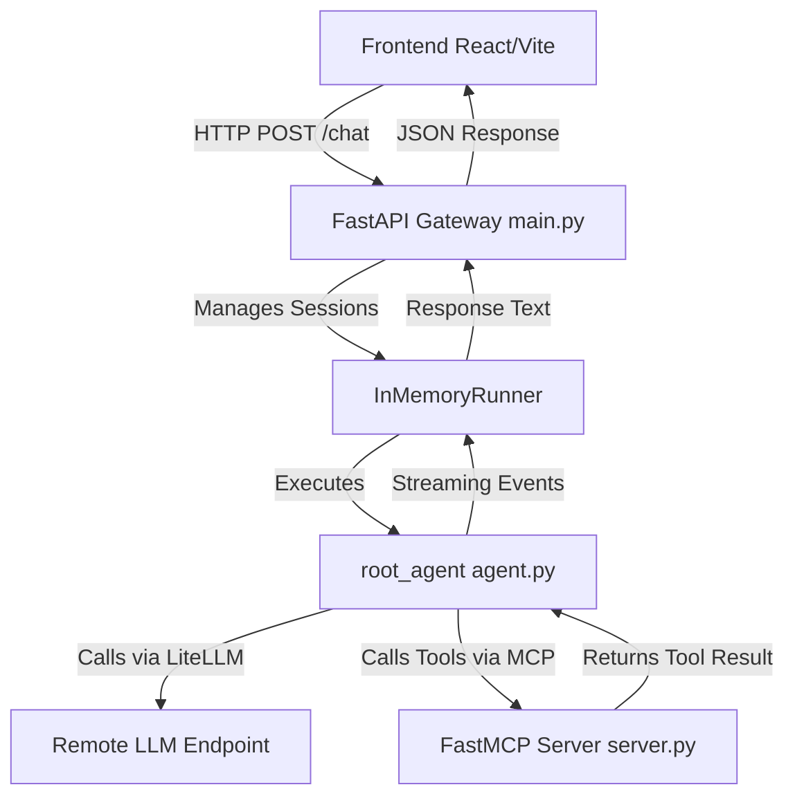

# GulliverTravels Architecture

This document provides a high-level overview of the GulliverTravels system architecture and the flow of data across the various components.

## 🏗️ System Overview

GulliverTravels is a multimodal agentic system consisting of a React frontend and a FastAPI backend powered by the **Google Agent Development Kit (ADK)** and the **Model Context Protocol (MCP)**.

---

## 📂 Core Components

### 1. Frontend (`frontend/src/App.jsx`)
- **Role**: The user interface.
- **Flow**: 
    1. Generates a unique `session_id` on load to track state.
    2. Sends user messages to `http://localhost:8000/chat`.
    3. Handles audio recording and sends it to `/transcribe`.
- **Key Files**: `App.jsx`, `main.jsx`, `package.json`.

### 2. Backend Gateway (`backend/src/travelagent/main.py`)
- **Role**: The orchestrator and entry point for all API requests.
- **Flow**:
    1. Receives the `ChatRequest` (message + user_id + session_id).
    2. Uses a global `InMemoryRunner` to maintain conversation history.
    3. Triggers the `root_agent` to process the message.
    4. Aggregates streaming events into a final response.
- **Endpoints**: `/chat`, `/transcribe`, `/tools/add`.

### 3. Agent Definition (`backend/src/travelagent/agent.py`)
- **Role**: Defines the "brain" of the system.
- **Flow**:
    1. Configured with a model via `LiteLlm` (pointing to a custom OpenAI-compatible endpoint).
    2. Contains the system instructions that define the agent's personality and behavior.
    3. Orchestrates tool calls if needed.

### 4. MCP Server (`backend/src/travelagent/server.py`)
- **Role**: A standalone tool server using the **Model Context Protocol**.
- **Flow**:
    1. Exposes specific functions (like `add_numbers`) as tools.
    2. The agent can "discover" and call these tools dynamically.
    3. Runs on a separate port (8001 by default).

---

## 🔄 Request Lifecycle (Example)

1. **User Types**: "Add 10 and 20" in the browser.
2. **Frontend**: Sends a POST request to `/chat` with `session_id="xyz"`.
3. **main.py**: 
   - Looks up `session_id="xyz"` in the `InMemoryRunner`.
   - Passes the request to `root_agent`.
4. **agent.py (ADK)**:
   - Sees the request requires a tool call.
   - Calls the `add_numbers` tool.
5. **server.py**: Executes `10 + 20` and returns `30`.
6. **main.py**: Receives the result, finishes the agent execution, and returns "The result is 30" to the frontend.
7. **Frontend**: Displays "The result is 30" to the user.

---

## 🛠️ Technology Stack

- **Frontend**: React, Vite, Vanilla CSS.
- **Backend API**: FastAPI, Uvicorn.
- **Agent Framework**: Google ADK (Agent Development Kit).
- **LLM Integration**: LiteLLM (via ADK extensions).
- **Tool Protocol**: FastMCP (Model Context Protocol).
- **Environment**: Python 3.13+, `uv` for package management.
